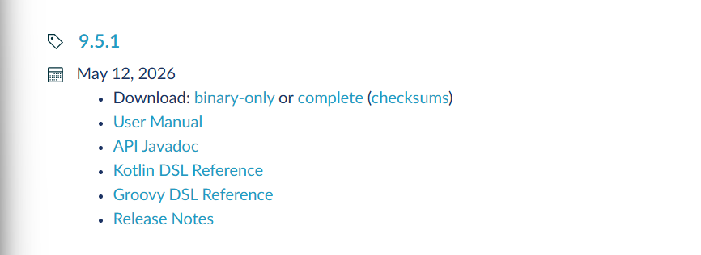
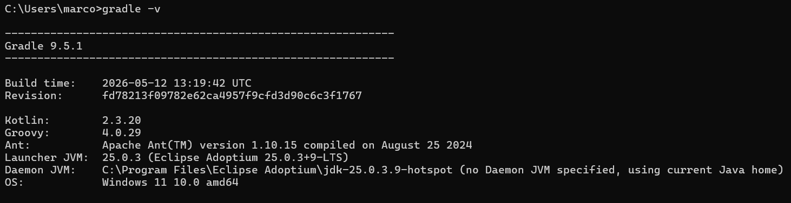

# Instalando o Java
Olá, daremos início ao estudo da linguagem de programação Java. Nesta aula, vamos aprender a como instalar a linguagem e a melhor configuração possível para conseguirmos trabalhar sem dor de cabeça. Bons estudos!!!

# 1) Onde baixar?
Acesse: https://adoptium.net/

Você entrará nesta página: 

Clique em "Baixar Temurin"

Após baixar, clique e execute o instalador para começar a instalação do Java.

Você irá chegar nesta parte: 

- O que fazer:
  - Clique no ícone do "X" vermelho ao lado de Set or override JAVA_HOME variable.
  - Selecione a opção "Will be installed on local hard drive" (deve ser a primeira da lista que aparecer).
  - Faça o mesmo para a opção de baixo: JavaSoft (Oracle) registry keys.

## Verificar se deu tudo certo:
No terminal do seu computador digite:
```terminal
java --version
```
Se aparecer algo parecido com isto: 
Deu tudo certo!!!


# 2) Instalando a IDE IntelliJ:
Para melhor experiência, iremos utilizar a IntelliJ como nossa principal IDE (mas você ainda pode optar pelo Vscode)

## 2.1 Download do instalador:
Vá para a página oficial da Jetbrains por esse link -> [Link](https://www.jetbrains.com/pt-br/idea/download/?section=windows)
Você será levado para esta página:


Selecione seu sistema operacional (Windows, Linux ou macOS) e em seguida clique em baixar

O instalador será baixado: 


Após isso, clique nele e você chegará até essa parte: 


O que marcar:

[X] IntelliJ IDEA (em Create Desktop Shortcut): Cria o ícone na sua área de trabalho para abrir fácil.

[X] Add "bin" folder to the PATH (em Update PATH Variable): Esse é obrigatório. Ele permite que o Windows reconheça os comandos do IntelliJ em qualquer terminal (como o prompt de comando ou Git Bash).

[X] Add "Open Folder as Project" (em Update Context Menu): Extremamente útil. Quando você tiver uma pasta com códigos no seu computador, basta clicar nela com o botão direito e escolher essa opção para abrir direto no IntelliJ.

[X] .java e [X] .kt (em Create Associations): Faz com que arquivos isolados de Java e Kotlin abram direto no IntelliJ por padrão quando você der dois cliques neles.Marque .gradle e .kts também

Depois de tudo isso, finalize clicando em "Install":


# 3) Baixando o Gradle:
Vamos baixar uma ferramenta que nos ajude a organizar nossos projetos

Acesse: [Site_Oficial_Gradle](https://gradle.org/releases/)

Você irá ver: 

- Agora siga esses passos:
  - 1) Baixando e instalando o ZIP:
      - Clique em "binary-only" e irá instalar o zip
      - Crie uma pasta chamada "Gradle" no "C:", pra ficar "C:\Gradle"
      - Extraia o conteúdo do ZIP para dentro dessa pasta. O caminho deve ficar algo como C:\Gradle\gradle-9.5.1
  - 2) Configurando as variáveis de ambiente:
      - 1) Pegando o caminho da pasta bin:
            1) Dê um duplo clique na pasta gradle-9.5.1 
            2) Lá dentro, você verá uma pasta chamada ```bin```. Entre nela.
            3) Agora, clique na barra de endereços (lá no topo, onde está escrito ```Este Computador > Acer (C:) > Gradle...```
            4) Copie esse endereço, o caminho deve ser algo como ```C:\Gradle\gradle-9.5.1\bin```
      - 2) Configurando o Windows:
            1) Aperte a tecla Windows no seu teclado e digite: ```Variáveis de Ambiente```
            2) Clique em "Editar as variáveis de ambiente do sistema"
            3) Na janelinha que abrir, clique no botão lá embaixo: Variáveis de Ambiente
            4) Na parte de baixo (Variáveis do Sistema), procure na lista o nome Path e dê um duplo clique nele
            5) Vai abrir uma lista de caminhos. CLique no botão "Novo" à direita
            6) Cole o caminho que você copiou
            7) Dê OK em todas as janelas
      - 3) Teste final:
            1) Abra o terminal e digite:
            ```gradle -v```

            Se aparecer algo como:

            Deu tudo certo, o Gradle está instalado!!!

# 4) Seu primeiro código em Java:
Agora que já temos tudo instalado, crie um arquivo chamado "OlaDevVasco.java" e nele copie:
```Java
public class OlaDevVasco {
    static void main(String[] args){
        System.out.println("Teste KA-ME-HA-ME-HAAAAAAAAAAAAAAAAAAAAA");
    }
}
```

No terminal digite:
```terminal
javac OlaDevVasco.java
```
Isso vai gerar um arquivo chamado "OlaDevVasco.class". Esse é o arquivo que o computador entende

E agora digite:
```terminal
java OlaDevVasco
```

No seu terminal aparecerá:


Agora sim, estamos prontos para o nosso estudo de Java. Acompanhe as próximas aulas e Bons estudos!!!