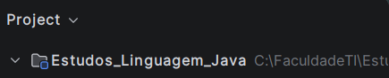
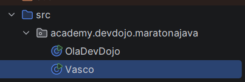
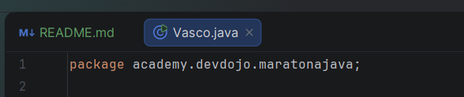

# ORGANIZAÇÃO DE PACOTES - JAVA
Ao longo do estudo de Java, iremos tratar nossos arquivos como pacotes para melhor organização.

Siga esses passos:

## 1) Criando o Directory:

Considere a seguinte imagem:



Aperte com o botão direito do mouse em "Estudos_Linguagem_Java" e vá em ```New > Directory```. Coloque o nome dele (vamos usar por exemplo o nome "src")

Agora que você criou a pasta, vá nela e clique com o botão direito em cima dela e vá em ```Mark Directory as > Sources Root```

Sua pasta irá ficar assim:


## 2) Criando o Package:

Aperte com o botão direito do mouse em cima do "src" e agora vá em ```New > Package```. Coloque o nome do seu Package ("usaremos "academy.devdojo.maratonajava")

Teremos algo assim: 


## 3) Criando nosso arquivo Java:
Aperte com o botão direito do mouse em cima do Package e vá em ```New > Java Class```, coloque o nome do arquivo (usaremos "Vasco" como exemplo)

Teremos algo assim:



Entre no arquivo e perceba que na primeira linha já teremos isso: 



Essa linha é o identificador de onde o arquivo está.

Assim, conseguimos compreender como funciona a organização de nossos arquivos e pacotes Java. Isso é de extrema importância para nossos estudos e para um melhor desenvolvimento de nossos projetos. 