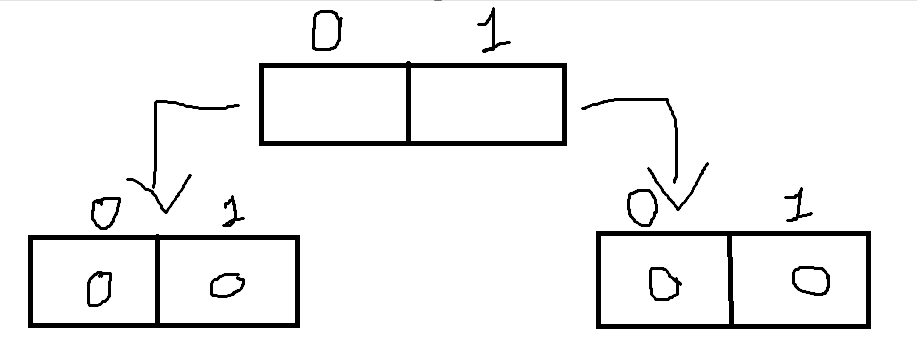
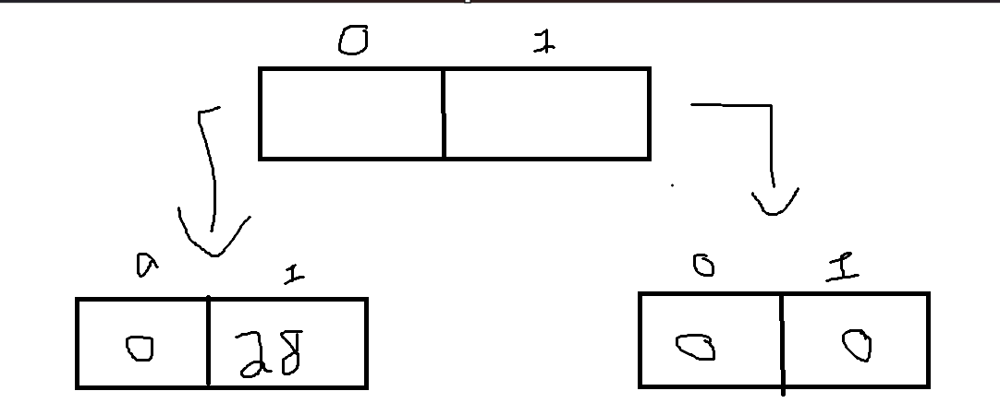

# Array Multidimensional
Um array multidimensional é um array de arrays usado para representar dados em múltiplas dimensões (como uma matriz).

A seguir veremos seu funcionamento, sintaxe e como usar


## Declaração:
Para declarar, seguimos o padrão abaixo:

```Java
tipo[][] variavel_nome = new tipo[3][4]; // O 3 representa o número de linhas, e o 4 o número de colunas
```
O tipo são os mesmos possíveis em uma array normal (verifique o arquivo '07_Arrays' para ver quais são)

## Funcionamento:
Quando temos uma variável que é uma array multidimensional, por exemplo essa abaixo:

```Java
int[][] dias = new int[2][2];
```
Temos mais ou menos isso:



Criamos 2 espaços com índices que vão de 0 à 1, onde cada um desses espaços tem 2 blocos atribuídos a eles, onde esses blocos vão do índice 0 à 1.

## Indexação/Acesso por índice:
Para acessarmos um espaço e atribuirmos um valor diretamente fazemos:

```Java
dias[0][1] = 28;
```

O que mudou:



## Usando for:
Em uma Array Multidimensional, precisaremos usar mais de um for, veja a seguir um exemplo:

Suponha que temos nossa variável `dias[2][2]` e queremos preencher todos seus espaços com o número `1`.

Solução:

```Java
int[][] dias = new int[2][2]; // Começam todos os espaços com 0

for (int i = 0; i < dias.length; i++){ // Percorre as linhas (dias.length pega o número de linhas)
	for ( int j = 0; j < dias[i].length; j++) { // Percorre as colunas (dias[i].length pega o número de colunas)
		dias[i][j] = 1; // Atribui 1 a todos os espaços
	}
}
```

## Foreach:
Podemos usar o Foreach para percorrer a array multidimensional:

```Java
for(int [] arrBase: dias){ // Criamos um array de referência chamada 'arrBase', ele irá referênciar cada ramificação de array
	for (int num: arrBase){ // Criamos um inteiro de referência chamada 'num', que vai percorrer cada bloco do array referênciado
		System.out.Println(num); // Printa na tela o valor de cada bloco
	}
}
```

## Inicialização:
Existem diversas formas de inicializarmos os arrays multidimensionais, aqui estão algumas maneiras:

#### Iniciando com valores:
Já colocamos os valores e consequentemente já dizemos o tamanho 

```Java
int[][] arrayInt2 = {{1,2}, {1,2,3}, {1,2,3,4}};
```

#### Iniciando com valores em cada posição:
```Java
arrayInt[0] = new int[] {1,2};
arrayInt[1] = new int[] {1,2,3};
arrayInt[2] = new int[] {1,2,3,4,5,6};
```

#### Usando um array pronto
Colocamos um array pronto em uma das posições do nosso array multidimensional
```Java
int [] arraySub = {3,2,1};
arrayInt[1] = arraySub;
```

#### Sem iniciar os valores
```Java
arrayInt[0] = new int[2]; // A posição 0 faz referência a um array de 2 posições
arrayInt[1] = new int[3]; // A posição 1 faz referência a um array de 3 posições
arrayInt[2] = new int[6]; // A posição 1 faz referência a um array de 3 posições
```

