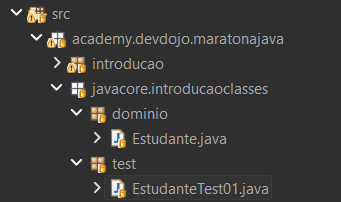

# Orientação Objetos - Introdução Classes
Até agora, estavamos trabalhando com tipos primitivos.

Exemplo:

```Java
int idade = 12;
char sexo = 'M';
```

Só que tudo isso pode ser agrupado em um único espaço de memória, por exemplo uma pessoa (que possui idade, sexo, tamanho e etc)

## Classes - Definição:
Um agrupamento de coisas do mundo real que darão origem a um objeto

Exemplo:

```terminal
pessoa
   |
   |-> Nome
   |-> Idade
   |-> Sexo
```

## Organização

### Pastas e arquivos
Para entendermos como devemos organizar nossas pastas, vamos usar um exemplo:



```Plaintext
src/
 └── academy.devdojo.maratonajava/
      └── javacore.introducaoclasses/
           ├── dominio/
           │    └── Estudante.java -> Define a Classe (o molde do objeto)
           └── test/
                └── EstudanteTest01.java -> Aqui vamos manusear o objeto
```

Usamos essa estrutura para separar o **Modelo** (na pasta domínio) da **Execução** (na pasta test)


### Código

**Estudante.java:** 

```Java
package academy.devdojo.maratonajava.javacore.introducaoclasses.dominio;

public class Estudante {
	public String nome; 
	public int idade;
	public char sexo;
}

```

Aqui temos o nosso objeto `Estudante`, ele possui nome, idade e sexo. Porém é apenas isso que contém no modelo. Perceba que ele não tem ``main`, então nada acontece quando executado, por isso chamamos de **modelo**.

**EstudanteTest01.java:**

```Java
package academy.devdojo.maratonajava.javacore.introducaoclasses.test;

import academy.devdojo.maratonajava.javacore.introducaoclasses.dominio.Estudante; // NÃO ESQUEÇA de importar o objeto, você deve dizer onde que ele se encontra.

public class EstudanteTest01 {
	public static void main(String[] args) {
		Estudante estudante = new Estudante(); // Criamos um objeto chamado "estudante" do tipo Estudante
		// Atribuindo valores aos atributos
		estudante.idade = 20;
		estudante.nome = "Leandro";
		estudante.sexo = 'M';
		
		// Imprimindo os atributos
		System.out.println(estudante.nome); // Imprime "Leandro"
		System.out.println(estudante.idade); // Imprime 20
		System.out.println(estudante.sexo); // Imprime 'M'
		
		System.out.println(estudante); // Imprime o endereço, por que é uma variável de tipo reference
	}
}

```
Nesse arquivo já mudamos o cenário, agora utilizamos esse objeto e seus atributos 