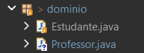

# Coesão - POO Java
Coesão em POO é o grau em que os elementos de uma classe estão relacionados a uma única responsabilidade, mantendo-a focada e organizada.

## Exemplo ERRADO
Temos uma classe chamada Estudante que contém inicialmente os atributos de um estudante. 


```Java
public class Estudante {
	public String nome;
	public int idade;
	public char sexo;
}
```

Porém, agora temos que adicionar atributos relacionados a professor.

A forma errada seria fazer:

```Java
public class Estudante {
	public String nome;
	public int idade;
	public char sexo;
	
	public String nomeProfessor;
	public int idadeProfessor;
	public char sexoProfessor;
}
```
Isso aqui inicialmente não é errado, vai funcionar porém de uma forma totalmente desorganizada. Pois, imagine que o projeto escalona, e agora teríamos que colocar o RG do professor. Ficaria uma classe Estudante com várias responsabilidades, e isso não estaria sendo coeso.

## Exemplo CORRETO:
Considere o mesmo cenário. Porém, agora iremos criar duas classes 



Professor.Java:

```Java
package academy.devdojo.maratonajava.javacore.Aintroducaoclasses.dominio;

public class Professor {
	public String nome;
	public int idade;
	public char sexo;
}
```

Estudante.Java:

```Java
package academy.devdojo.maratonajava.javacore.Aintroducaoclasses.dominio;

public class Estudante {
	public String nome; 
	public int idade;
	public char sexo;
}

```

Assim fazemos com que cada classe tenha uma só responsabilidade, mantendo a coesão