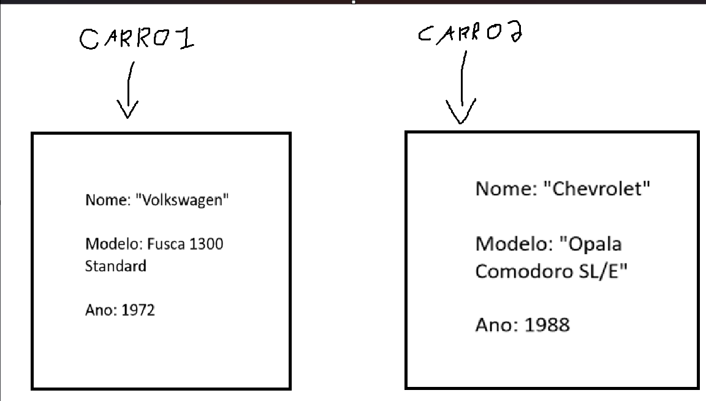

# Referência de Objetos - POO Java
Considere o cenário:

Temos uma classe chamada `Carros`, onde temos Nome, Modelo e ano como atributos.

Carros.Java:

```Java
package academy.devdojo.maratonajava.javacore.Aintroducaoclasses.dominio;

public class Carros {
	public String nome;
	public String modelo;
	public int ano;
}

```

CarrosTest01.Java:

```Java
package academy.devdojo.maratonajava.javacore.Aintroducaoclasses.test;

import academy.devdojo.maratonajava.javacore.Aintroducaoclasses.dominio.Carros;

public class CarrosTest01 {

	public static void main(String[] args) {
		Carros carro1 = new Carros();
		Carros carro2 = new Carros();
		
		// Carro 1
		carro1.nome = "Volkswagen";
		carro1.modelo = "Fusca 1300 Standard";
		carro1.ano = 1972;
		
		// Carro 2
		carro2.nome = "Chevrolet";
		carro2.modelo = "Opala Comodoro SL/E";
		carro2.ano = 1988;
		
		System.out.println("Nome:" + carro1.nome + " Modelo:"+ carro1.modelo + " Ano:" + carro1.ano);
		
		System.out.println("Nome:" + carro2.nome + " modelo:"+ carro2.modelo + " Ano:" + carro2.ano);
	}

}
```

Saída no terminal:

```terminal
Nome:Volkswagen Modelo:Fusca 1300 Standard Ano:1972
Nome:Chevrolet modelo:Opala Comodoro SL/E Ano:1988
```

Temos a seguinte situação:



`carro1` e `carro2` são variáveis de referência, e cada um aponta para um local específico de memória.

Agora surge a pergunta: "E se quisermos que o `carro2` aponte para o local de memória de `carro1`?"

Aqui está a solução:

```Java
carro2 = carro1; // Agora "carro2" aponta para o endereço de memória de "carro1"
```

Código completo de `CarrosTest01`:

```Java
package academy.devdojo.maratonajava.javacore.Aintroducaoclasses.test;

import academy.devdojo.maratonajava.javacore.Aintroducaoclasses.dominio.Carros;

public class CarrosTest01 {

	public static void main(String[] args) {
		Carros carro1 = new Carros();
		Carros carro2 = new Carros();
		
		// Carro 1
		carro1.nome = "Volkswagen";
		carro1.modelo = "Fusca 1300 Standard";
		carro1.ano = 1972;
		
		// Carro 2
		carro2.nome = "Chevrolet";
		carro2.modelo = "Opala Comodoro SL/E";
		carro2.ano = 1988;
		
		carro2 = carro1; 
		
		System.out.println("Nome:" + carro1.nome + " Modelo:"+ carro1.modelo + " Ano:" + carro1.ano);
		
		System.out.println("Nome:" + carro2.nome + " modelo:"+ carro2.modelo + " Ano:" + carro2.ano);
	}

}

```

Saída no terminal: 

```terminal
Nome:Volkswagen Modelo:Fusca 1300 Standard Ano:1972
Nome:Volkswagen modelo:Fusca 1300 Standard Ano:1972
```